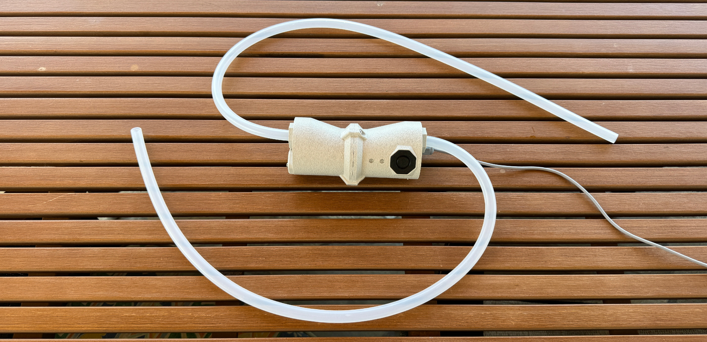

# OpenValve Beyond Irrigation

OpenValve was originally designed for irrigation. The soil moisture sensor and the firmware turn it into an irrigation controller.

Take those irrigation-specific parts away, and you are left with an **open-source pinch valve**. From there, the project is yours to shape: add your own sensor, write your own firmware, or connect it to another system and use just as a valve.

> [!NOTE]
> **OpenValve comes with one finished application.** What you build around the valve is up to you.

At its core, OpenValve is a bistable pinch valve. It switches quickly, only needs power while moving, and has low internal flow resistance when open. The standard version uses **½-inch BSPP threads** because they are common in irrigation and provide secure connections for pressurised water systems. Not every project needs that, though.

Some projects do not need threaded fittings or higher pressure handling. Instead, they benefit from a clean, uninterrupted flow path. For this, I made an [alternative fitting](../hardware/3D-models/ASA-parts/alternativeParts/) that allow one continuous hose to run straight through OpenValve.

The hose can be inserted from the outside without opening the housing. OpenValve pinches the hose from the outside, while the liquid stays inside the hose for the entire path through the valve. The liquid never touches the valve mechanism or housing, similar to a peristaltic pump. The difference is that OpenValve does not pump the liquid. It only opens or closes the hose, while gravity or another external pressure source moves the liquid. Because of that, OpenValve needs only a fraction of the electrical energy that a peristaltic pump would need to move the same amount of liquid, making it generally a good candidate for battery-powered applications.

To give you an idea of where this could become handy, here are a few things I could imagine building with it:

* a gravity-fed cocktail robot, with ingredient bottles above the machine and one valve controlling each ingredient
* a drink dispenser for water, juice, cold brew, syrups, or other liquids
* a small automated refill system for tanks, containers, or reservoirs that refills from an elevated reservoir when a water-level or weight sensor detects that it is low
* a simple timed dosing system for aquarium additives, hydroponic nutrients, fertiliser, or cleaning liquids
* a DIY dispenser for sauces, soap, or other liquids where the product should stay inside a replaceable hose

## Recommended hose for the continuous-hose fittings

OpenValve is designed for hoses with:

* **Inner diameter:** **8 mm**
* **Outer diameter:** **12 mm**
* **Hardness:** **60 Shore A ±10**

The hose hardness is important. A hose that is too hard needs more force to pinch closed, and there is a real risk that it will not fully recover after being pinched. In that case, the hose can stay partially collapsed even when the valve opens, restricting or completely blocking the flow. This is a serious issue and should be considered carefully when choosing a hose.

I tested a range of hose materials and hardnesses. So far, a silicone hose with a **shore hardness of 60A** is the only option that has worked reliably for this design so far.

Because the liquid only touches the inside of the continuous hose, the hose material alone determines which liquids can be transported with it. A certified food-safe silicone hose can for example be used for food-contact applications, as long as the other wetted parts in the final system are also suitable for that use.

## Firmware templates for other projects

The hardware can be used for many different ideas, but the current firmware was built for irrigation. There are no ready-made guides or template firmwares for the examples above yet.

Right now, using OpenValve for a different purpose means adapting the irrigation firmware yourself. That is possible, but it is more work than it should be.

I want to change that by creating small, well-documented template firmwares for practical use cases. These will mostly not be finished and polished firmwares, but simple starting points for projects such as a timed dispenser, a tank refill system or a firmware that just waits for a digital input to open/close the valve.

Have an idea you would actually like to build? [Join the Project Discord](https://discord.gg/JMEDK97xuT) and share it, or write DM. Concrete ideas help me decide which templates and guides to create first.
