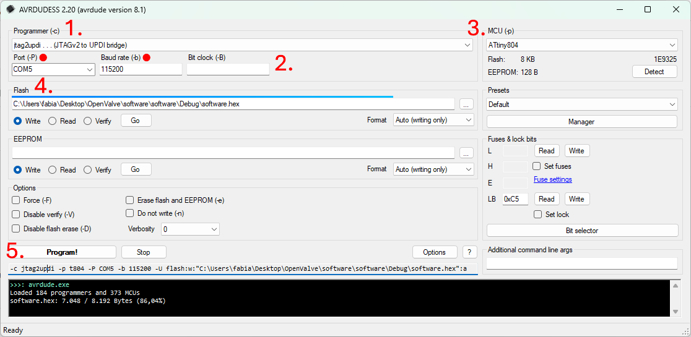

# 🧠 Firmware

The firmware can be opened, modified, and built using [Microchip Studio](https://www.microchip.com/en-us/tools-resources/develop/microchip-studio).

## 🔌 Flashing Firmware

### UPDI Programmers

OpenValve uses **UPDI (Unified Program and Debug Interface)**.  
To flash firmware, you’ll need a **UPDI programmer**.

You have two options:

#### 1. Make your own programmer:

If you have an **Arudino Uno or Arduino Nano** or any other MCU Board based on the ATMEGA328P lying around you can quite easily use those as a UPDI programmer. The only additional hardware components you need are:
Any capacitor of 1uF or more, and a few jumper wires. 

If you have those components, use the following video as a reference to prepare your programmer:

👉 https://www.youtube.com/watch?v=AL9vK_xMt4E

#### 2. Buy a ready-made programmer
The **NanoUPDI** for example is an inexpensive ready-to-use option:

- GitHub: https://github.com/umbertoragone/nanoupdi  
- Available on:
  - https://lectronz.com/  
  - https://www.tindie.com/  

There are also many other inexpensive UPDI programmers available. When buying one make sure there is the option to set the power output of the programmer to 3.3V.

### How to flash new firmware

The easiest way to flash new firmware without installing Microchip Studio is by using [AVRDUDESS](https://github.com/ZakKemble/AVRDUDESS):

Get the newest firmware from the latest release. Connect OpenValve with your programmer using jumper cables. Make sure the programmers **output power Pin is 3.3V, not 5V**. Then connect the programmer with your PC via USB. 

Open AVRDUDESS and:

1. Choose the right programmer. jtag2updi for Arduino Uno/Nano based programmer, or SerialUPDI for the NanoUPDI programmer.
2. Choose correct PORT (USB port of your programmer) and Baudrate: 115200
3. Choose correct MCU: ATtiny804
4. Choose firmware binary that should be flashed. (.hex file from the release)
5. Hit Program! 

### ⚠️ Important Warning

The DC motor control logic located in `software/valve.c` is **highly tuned and timing-sensitive**.  
Modifying it without fully understanding the mechanism will **very likely destroy the motor gearbox**.

Proceed with extreme caution when changing anything related to:

- motor control timing  
- stall detection  
- open/close cycle control 

